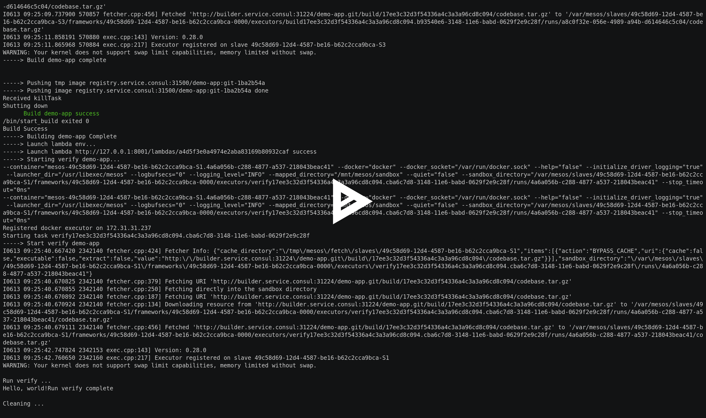

# cde PaaS

## 什么是cde

cde 是一个平台，在平台上你可以完成开发，测试，部署，运维整个软件的开发生命周期的管理。cde 是一个以技术栈为中心的，应用管理方案。

## 平台

首先 cde 是一个平台。所谓的平台就是进行某项工作所需要的环境或条件。 在 cde 上，所有的用户不用关心底层的实现，而只需要关心他们所需要关心的东西。

## 技术栈中心

技术栈是用来实现某种功能（目标）的组合。比如用来实现REST api，你往往会用到 java, spring mvc, gradle, mysql, redis 这样的一个组合。这个组合就是我们用来实现REST api的一个技术栈。这个技术栈为测试环境，和生产环境中提供正常服务。纵观整个开发过程，其实可以概括一下几个过程

1. 编写相应的代码
2. 将编写的代码转换成一个可以执行的应用
3. 验证这个可执行应用是否符合我们的预期，如果验证通过，发布这个可执行应用。否则这次修改失败
4. 部署这个可执行应用

以一个java REST api 开发的例子来讲，第一步完成的就是开发人员根据相应的业务完成相应的业务代码。第二步准备java 编译环境，准备相应的依赖，来构建出最终的jar包或者war包。概括来说就是准备相应的环境，用一组工具来完成代码到可执行应用的转变，即 **编译的技术栈**）。第三步构建一个REST api 验证环境，比如使用gatling 来完成性能测试，使用 concording 完成集成测试。概括来讲就是准备相应的环境，用一组工具来完成可执行应用的验证，即 **验证的技术栈**。第四步，通过准备相应的环境，mysql在哪里，war 包应该被部署在那个容器内，redis 应该部署在哪里，将这一组工具或者服务启动成一套可以服务的环境。即使用 **应用技术栈** 启动一套服务的环境。


[](https://asciinema.org/a/evfqs2o1ox8ch70chlzmomgcp)

## 为什么使用 cde？

谈到为什么用 cde 其实需要从我们当前软件开发来讲起。现在的开发流程是

```
需求分析->技术栈选型->开发环境搭建->基础环境搭建->开发流程搭建（CI/CD）-> 开发
                                                                 |
                                                                 |
                                                                 |
                                                                 V
                                                部署<-发布<-验证<-构建

```

对于一个公司来讲，需要使用不同的技术栈来支撑相应的业务（使用c\/c++技术栈来完成计算密集型业务，使用nodejs来完成io密集型业务），但是从我们整个开发流程中没有一个很好的机制来完成不同技术栈的积累，从而达到技术栈积累所带来的放大效应。在这样的开发流程中，重用往往限于某一个组件，或者代码，脚本的复用。但是一个技术栈下简单的代码复用并不能达到最佳的复用效果。一个技术栈只有伴随着流程，以及关键的最佳实践才能达到最好的复用效果。为了这样的达到复用的最好的效果（流程和关键最佳实践的复用），很多公司往往采用高成本的方式------采用请外部的敏捷咨询，或者敏捷教练的方式。但是随着技术的发展，复用流程和关键最佳实践已经变得可行。cde 使得技术栈的积累变得可能，并且随着技术栈的积累，完成的是技术栈相关的流程和关键最佳实践的积累与复用，从而能够达到最佳的复用的效果。于此同时，技术栈的管理和使用需要的能力是不同的能力，由于过去技术栈流程和关键最佳实践复用上的限制，对于技术栈的管理和使用的能力没有明确的划分，人员的能力，团队结构，成本不能达到一个最优的组合，通过对分离两种角色---技术栈管理者、技术栈使用者，将两种能力进行明确的划分。从而为人员能力、团队结构、成本达到最优组合提供保障。

## 我能用 cde 做什么？

### 功能

* 以技术栈即代码方式完成技术栈管理
* 通过 流程框架完成 自定义开发流程的搭建
* 应用管理
* 技术栈管理者、技术栈使用者用户以及协作的管理

### 业务

* 围绕着技术栈的能力管理
  * 使用 cde 后很人员角色分工非常清楚。技术栈管理者的能力就是能否将一个业务上的选型转化成相应的技术栈
  * 对于技术栈的使用者的能力使用某个技术栈，完成某个功能所用的时间。

* 针对以上两个方面，我们构建了自己的考试系统。可以在考试系统上验证技术栈管理者构建技术栈的能力，于此同时可以验证技术栈使用者使用技术栈的能力。

## 特性

cde 是一个全功能的 `PaaS`，它管理一个应用的完整的生命周期。在 Cde 创建应用只需要简单的设置应用所需的栈（stack）并通过 `git` 提交代码.

cde 可以构建任何语言、任何框架的应用。整个构建的过程都过 `dockerize` 的方式进行，一个应用通过 `git push` 提交给 cde 后经过如下的步骤将应用部署在 cde 中。

1. **容器管理集群** cde 底层采用 `mesos` + `marathon` 作为其基础设施并在 `marathon` 中以容器的形式运行所有的应用，应用以及其所依赖的服务都是以容器的形式出现在集群中，任何在 docker hub 中所出现的 image 都可以在 cde 中使用。
2. **应用编排** 通过编写 `stackfile.yml` 定义应用所依赖的服务（backing services），在应用的端到端测试与应用部署时，cde 会依据 `stackfile.yml` 启动这些服务。
3. **内置 CI** cde 默认提供了一套 `build - verify - deploy` 的流程，相当于为应用的开发提供了默认的 ci。
4. **分布式存储** docker 作为一个无状态的任务执行单元可以启动在集群的任意节点上，但如果容器作为存储单元（例如 mysql）时就会导致数据丢失。cde 中内置了一个 `ceph` 的分布式存储集群为所有的应用提供稳定可靠的存储空间。

