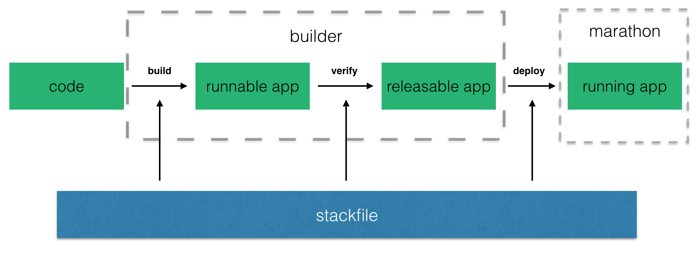

# cde Paas

cde 是一个全功能的 `PaaS`，它管理一个 web 应用的完整的生命周期。在 Cde 创建应用只需要简单的设置应用所需的栈（stack）并通过 `git` 提交代码.

cde 可以构建任何语言、任何框架的应用。整个构建的过程都过 `dockerize` 的方式进行，一个应用通过 `git push` 提交给 cde 后经过如下的步骤将应用部署在 cde 中。

其中 `stackfile` 为栈描述文件，它描述了一个代码库在 `build` `verify` `deploy` 的过程中所需要的打包编译流程、功能测试脚本以及部署时所依赖的服务。

## 特性

1. **容器管理集群** cde 底层采用 `mesos` + `marathon` 作为其基础设施并在 `marathon` 中以容器的形式运行所有的应用，应用以及其所依赖的服务都是以容器的形式出现在集群中，任何才 docker hub 中所出现的 image 都可以在 cde 中使用。
2. **应用编排** 通过编写 `stackfile.yml` 定义应用所依赖的服务（backing services），在应用的端到端测试与应用部署时，cde 会依据 `stackfile.yml` 启动这些服务。
3. **内置 CI** cde 默认提供了一套 `build - verify - deploy` 的流程，相当于为应用的开发提供了默认的 ci。
4. **分布式存储** docker 作为一个无状态的任务执行单元可以启动在集群的任意节点上，但如果容器作为存储单元（例如 mysql）时就会导致数据丢失。cde 中内置了一个 `ceph` 的分布式存储集群为所有的应用提供稳定可靠的存储空间。